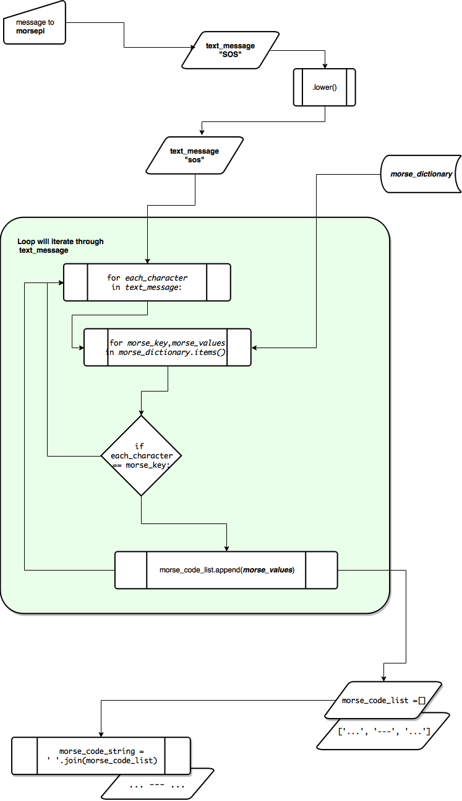

# Modular programming tutorial

## This repository host all the files in the Morse Code tutorial.

This repository is to support the video and written morse code tutorials:
* **Tutorial:** [defcodeblog](https://wp.me/p8k2yu-4)
* **Videos:** [defCode YouTube](https://www.youtube.com/watch?v=yRuAog2SU9o&list=PLUUO_MQ7WDOdUgf_EXXDLwJI_K0b5JjQ6)

How to design and program a morse code module and integrate it into other scripts to illustrate modular programming. `morsepi.py` module can be leverage by other applications, such as:

* Morse module: **morsepi.py**

* A terminal UI: **01_system_console.py**
* Web interface
* Voice interface
* Raspberry pi GPIO integration
* Possible Alexa integration

File name | Location | Description
---------|----------|---------
 morsepi.py | root | primary morse code module
 01_system_console.py | root | system console ui morse pi integration
 morsepi_sequential.py | dev | morsepi script written sequentially
 morsepi_sequential_function.py | dev | morsepi written in sequence as a function
 morse_logic.png | media | script logic info-graphic

---
### The `morsepi.py` module has the following programming logic:
The module will have a morse code dictionary with the alphabet, numbers and characters with each character's corresponding morse code. The string will be contained in a variable, it will turn into lower case characters and then reassign to the same variable. A loop will iterate through each character in the message, and compare to every key in the dictionary, if the character matches a key, then a list will be appended with the corresponding morse code, this list will have to be converted into a single string for further use.

---

Thank you

defCode
